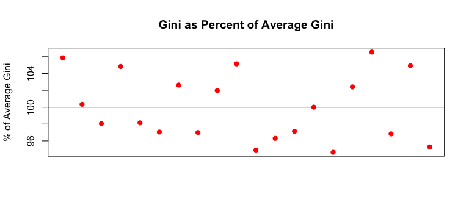

```{r setup, include=FALSE}
knitr::opts_chunk$set(echo = TRUE)
```
<style>
body {
text-align: justify}
</style>
# Introduction

Following the recent discovery that the risk models used previously were too ad-hoc to be suitable for a bank environment with strict regulatory requirements, the task of completely rebuilding the loan default model has arisen. New management has ordered for a ‘ground-up’ rebuild of the credit risk models using appropriate statistical tools, methods and performance measures. Specifically, with regards to the new credit risk model, management requires answers to their several primary concerns:

  1. How does this model perform compared to the previous? How can it be expected to perform on new loans? 
  1. What are the important variables in this model and how do they compare to variables the bank has found to be traditionally important in its own modelling?
  1. What assurances and justifications can be made about the statistical rigor of the model and modelling methodology?

To formally address management’s inquiries, statistical techniques can be applied whereby a binomial general linear model is fit to this binary data to provide the base for further inference. Successfully estimating a model will allow conclusions to be formed in relation to the merit of the model compared to the benchmark, and reveal the importance of loan characteristics as determinants of default.  

Before statistics can take over and provide answers to the above questions, there is an important step of pre-processing and checking the quality of the underlying data. The next three sections provide a first insight into the patterns inside the loan data, and an insight on the trustworthiness of the data itself. 

# Section One: Data Viewing
A credit scoring model is a tool that is typically used in the decision-making process of accepting or rejecting a loan. It is the direct result of a statistical model which, based on information about the borrower (e.g. annual income, number of previous loans, etc.), allows banks to distinguish between "good" and "bad" loans and give an estimate of the probability of default. A database export of historical lending between 2007 and 2011 has been provided to act at the foundation of this new model. The goal is to identify which characteristics of loans/loan holders hold a relationship with default, and use this information to build a model to apply for future predictions. 

The dependent variable in this circumstance is identified as a binary variable – where 0 indicates that specific loan holder did not default, while 1 indicates they did. Looking into the scope of the given data, there are 38 478 observations, and 15.15% of the loans over this five year period ended in default. This percentage of default is adequate for the modelling process to take place – as any less percentage of defaults may not provide enough data to accurately identify which characteristics influence default.     


```{r load data, echo=FALSE, warning=FALSE, message=FALSE}
library(readr)
library(caret)
library(pROC)
library(ROCR)
dataset <- read_csv("BackgroundFiles/data.csv")
dataset<-as.data.frame(dataset) # because tibbles don't like removed columns

# remove the first two rows
dataset <- dataset[-c(1, 2), ]
# make factors
dataset$term <- as.factor(dataset$term)
dataset$emp_length <- as.factor(dataset$emp_length)
dataset$home_ownership <- as.factor(dataset$home_ownership)
dataset$purpose <- as.factor(dataset$purpose)
```
```{r display head, include=TRUE,  warning=FALSE, message=FALSE}
dim(dataset)
sum(dataset$repay_fail)/length(dataset$repay_fail)
head(dataset)
```

Accompanying the dependent variable are 37 characteristics of the loans. These independent variables are a mix of loan characteristics, personal characteristics of the applicant, personal financial status of the applicant, and recordings of loan specific quantities. For a variety of reasons, not all of these predictors will be eligible for the binomial model, and can be culled accordingly. The following section will conduct multiple methods to reduce this set of 37 characteristics into a small group of variables that can be applied to the forthcoming statistical processes.  


# Section Two: Manually Culling Variables
The aim here is to build a model that predicts the probability of loan default based on information known at the time of application. Looking into the variables given, many are ones that are revealed throughout the duration of the loan, such as number of recoveries or last payment amount, so they could not be considered for this model. As a result of this reasoning, 16 independent variables were immediately removed from the potential model candidates.

* Funded amount   
* Funded amount Investors   
* Issue Date   
* Loan Status   
* Months since last Delinquency    
* Revolving Balance   
* Revolving Line Utilisation Rate    
* Total Payment   
* Total Payment Investors   
* Total principal received   
* Total interest received   
* Recoveries    
* Last Payment Date   
* Last Payment Amount   
* Next Payment Date   
* Last Credit Pull Date   
 

It is understood that sometimes this information can be collated from previous loans in a customer’s name and used to predict their new information, however these variables were specifically related to the loan that was recorded as defaulted or not – so they could not be included here. 

With further verbal reasoning and industry advice, grade, sub-grade and verification status were all removed as they relate to a previous score system for applicants that have since been replaced, thus they are no longer relevant. Similarly, interest rate was also disregarded as it is more of an economic variable rather than a personal characteristic, so again, it doesn’t suit the model’s scope.

Using the two dates provided in the dataset, a new variable referring to the time in months of this new loan since the first loan in the applicant’s credit history was introduced. This was created using the difference between the ‘Issue date’ and ‘Earliest credit line’. It is possible that such a measurement may reveal insight into a borrower’s history and perhaps be a predictor of default – so it is added to the list of variables to be statistically considered.

###Correlation Matrix 
With 15 potential predictor variables remaining, a correlation matrix was constructed including any characteristic measured in a continuous way – such as the dollar value of loan amount. When two or more variables are highly correlated, it means they follow the same trend and have the same effect on the dependent variable – so usually only one is kept to describe that phenomenon. The data was investigated for any correlations that exceeded 0.85 – where 1 describes perfect correlation. As is shown in the correlation matrix and plot, loan amount and instalment were found to be highly correlated and display a very similar trend. Specifically, as loan amount increases, instalment is also found to increase at an almost identical linear manner. From both intuition and professional advice, instalment was removed. It was therefore concluded that loan amount would appropriately cover any insight into defaulting probabilities that would have been provided by instalment.
   

```{r plot installment to loan amount, echo=FALSE, warning=FALSE, message=FALSE}
plot(dataset$loan_amnt[seq(1,38800, 5)], dataset$installment[seq(1,38800, 5)], xlab = "Loan Amount", ylab = "Installment", main = "Loan Amount vs Installment")
```

# Section Three: Checking the Data
### Addressing Missing Information
Before the modelling could begin, the data was checked for the absence of information. Of the remaining variables being considered for the binomial regression, two held missing points. For annual income, one information point was missing – therefore that observation was simply removed. For employment length, however, there were over 900 observations with this information missing, so it was not appropriate to remove these before investigating whether the presence of “NA” held an effect of its own. A new level/category of employment length called NA was introduced, which used an indicator variable to identify these observations – 1 being the observation of annual income was not present, and 0 being the information was present. A univariate binomial generalised linear model was fit containing default as the binary dependent variable and employment length as the sole dependent with the purpose of investigating whether NA showed up as statistically significant or not. As shown, NA was extremely statistically significant, therefore there was strong evidence to suggest these observations should not be removed from the data, but rather an additional application category of NA should be added to the options. In terms of application categories for a new loan, the options associated with employment length less than one year, one year, …, 10+ years, with the new addition of NA. (Perhaps this may indicate an applicant is unemployed).

```{r process data, echo=FALSE, warning=FALSE, message=FALSE}
# useful from words:
dataset <-
  dataset[, c(40, 4, 7, 9, 12, 13, 14, 18,  21, 22, 24, 27,  30, 41)]
# put repay_fail as first column

# Count NA's for each predictor
missing.count <-
  as.data.frame(matrix(data = NA, ncol = length(dataset)))
colnames(missing.count) <- names(dataset)
for (i in 1:length(dataset)) {
  missing.count[1, i] <- sum(is.na(dataset[, i]))
}
# remove subject with a missing value from annual income
dataset <- dataset[!is.na(dataset$annual_inc), ]
# Remove installment
dataset <- dataset[-4]
covariate.indicator <- c(2, 4, 6, 8, 9, 10, 11, 12, 13)
# convert emp_length NA's into a new level & check significance
dataset$emp_length <- addNA(dataset$emp_length)
levels(dataset$emp_length)[12] <- "missing"
dataset$emp_length <- factor(dataset$emp_length,levels(dataset$emp_length)[c(1,12,2,4:11,3)])
# make missing the last level
dataset$emp_length <- factor(dataset$emp_length,levels(dataset$emp_length)[c(2:12, 1)])

#### Compare annual income as continuous against factor----
dataset$fac.annual_inc <- cut(dataset$annual_inc, breaks = quantile(dataset$annual_inc, seq(0, 1, .1)))


fit.cont.annual_inc <-  glm(repay_fail~annual_inc,data = dataset,na.action = na.exclude,family = "binomial")

fit.fac.annual_inc <-  glm(repay_fail~fac.annual_inc,data = dataset,na.action = na.exclude,family = "binomial")
# drop continuous income
dataset <- dataset[,-6]
```

```{r showmissing, echo=TRUE, warning=FALSE, message=FALSE}
missing.count
```
### Addressing Outliers
In assessing the distribution of the data amongst the predictor variables, it was noticed that most of the annual incomes were grouped together in a similar range - apart from some extreme outliers. It is possible that these outliers could hold the ability to skew the effects of the income variable, which would cause the need for a change in data form. To investigate this, a univariate model was fit containing default as the binary dependent variable and annual income in its continuous form as the dependent. 
 
 
**Continuous Annual Income**
```{r continuous income, echo=TRUE, warning=FALSE, message=FALSE}
summary(fit.cont.annual_inc)$coefficient[,4]
summary(fit.cont.annual_inc)$aic
```


**Discretized Annual Income**
```{r discretized income, echo=TRUE, warning=FALSE, message=FALSE}
summary(fit.fac.annual_inc)$coefficient[,4]
summary(fit.fac.annual_inc)$aic
```
Following this, annual income was grouped into 10 equal bins. As is shown, the AIC for the categorical depiction of Annual Income is smaller than that of the continuous.While identifying numerical values into specific groups can sometimes lead to a loss of information, it is proven to enhance the statistics in th.  is situation by removing the effects of these extreme outliers – therefore annual income will be treated in this categorical manner for the remaining investigation.

###Variables Remaining for Model Fitting
After completing this manual culling of the data through intuition and statistical analysis, 14 independent variables remain as potential candidates for the model fitting process. The variables are a good mix of loan characteristics, personal characteristics of the applicant and personal financial status of the applicant – however it is the statistical process used in the following section that will decide which of these can be used as predictors of loan default. 

**Loan Characteristics:**    
 
* Loan amount   
* Term    
* Purpose   

**Personal Characteristics**

* Employment length
* Home ownership status
* Annual income
* Public Record
    

**Personal Financial Status**  

* Debt to income ratio
* Delinquencies in the last 2 years
* Earliest credit line
* Inquires in the last 6 months
* Number of open accounts
* Total accounts
* Time since the first loan
 
 

#Section Four: Model Fitting
###Logistic Regression
Assuming past behaviour is a predictor of future behaviour, the aim is to create a statistical model to be able to predict the probability that a new debtor will not repay the debt-holder. One of the most common and successful ways to create a model from binary data via a binomial generalised linear model – specifically with the logistic function. The logistic regression is suited to the credit risk model because many of the independent variables are categorical, the result is required to be a probability/percentage (which is not possible for the linear regression model) and the variability of the dependent variable is not constant (whereas it is assumed constant in the linear regression). This logistic function is the log of odds ratio and provides a ratio of the probability of default occurring against it not.

The logistic model as shown takes as input the client characteristics and outputs the probability of default.
\[p=\exp(\beta_0+\beta_1X_1+...+\beta_nX_n)/(1+exp(\beta_0+\beta_1X_1+...+\beta_nX_n))\]

Where:  
P= probability of default  
Xi = the explanatory variable i  
Bi = the regression coefficient of the explanatory variable i  
N = the number of explanatory variables

###Preliminary Plots
For the logistic model to be appropriate in this content and with the given data, plots of each of the independent variables against the logit of the dependent variable need to be assessed. The plots are analysed for their visual form, where an approximate linear increase or decrease suggests the variable is suited to the logistic regression. 

```{r plot univariate covariates, echo=FALSE, warning=FALSE, message=FALSE}
covariate.indicator <- c(2, 7:11)

y <- dataset$repay_fail
for (i in covariate.indicator) {
  x <- as.numeric(dataset[[i]])
  ifelse(i == 8, # delinq_2yrs integers 0:11
         g <- cut(x, breaks = c(1:11)),
         ifelse(
           i == 9, # inq_last_6mths integers 0:33
           g <- cut(x, breaks = seq(1, 33, 33 / 10)),
           ifelse(i == 10, # pub_rec integers 0:5
                  g <- cut(x, breaks = seq(0, 5, 1)),
                  g <-cut(x, breaks = quantile(x, seq(0, 100, 10) / 100))
           )))
  ym <- tapply(y, g, mean)
  xm <- tapply(x, g, mean)
  mainTitle <- ifelse(i == 8,paste("Repay Failure Rate of ", names(dataset)[i], "\n 9% Bins", sep = ""),ifelse(i == 10,paste("Repay Failure Rate of ", names(dataset)[i], "\n 20% Bins", sep = ""),paste("Repay Failure Rate of ", names(dataset)[i], "\n 10% Bins", sep = "")))

  ymp <- log(ym / (1 - ym))
  plot(xm,ymp,xlab = names(dataset)[i],ylab = "Logit of Proportion of Defaulters",
       main = ifelse(i==10, paste("Repay Failure Rate of ", names(dataset)[i], "\n 20% Bins, ", "3 Predictions Inf", sep = ""), mainTitle),pch = 19,col = "blue")
  abline(lm(ymp[is.finite(ymp)]~xm[is.finite(ymp)]))}
```

```{r plot univariate factors, echo=FALSE, warning=FALSE, message=FALSE}
  # Factors into tables, each column is percent of subjects of that level who did not, then did refault
y<-dataset$repay_fail
q <- colSums(table(y,dataset$term))
q <- rbind(q,q)

barplot(signif(table(y,dataset$term)/q, 3)*100,col=c("darkblue","white"), ylab = "% Repaid", main = "Percent of Loans Repaid by Loan Term")

q <- colSums(table(y,dataset$emp_length))
q <- rbind(q,q)

barplot(signif(table(y,dataset$emp_length)/q, 3)*100,col=c("darkblue","white"), ylab = "% Repaid", main = "Percent of Loans Repaid by Employment Length")

q <- colSums(table(y,dataset$home_ownership))
q <- rbind(q,q)

barplot(signif(table(y,dataset$home_ownership)/q, 3)*100,col=c("darkblue","white"), ylab = "% Repaid", main = "Percent of Loans Repaid by Home Ownership Status")

q <- colSums(table(y,dataset$purpose))
q <- rbind(q,q)

barplot(signif(table(y,dataset$purpose)/q, 3)*100,col=c("darkblue","white"), ylab = "% Repaid", main = "Percent of Loans Repaid by Loan Purpose", xaxt = "n",sub = "car, credit_card, debt_consolidation, educational, home_improvement, house,\n major_purchase, medical, moving, other, renewable_energy, small_business, vacation") 

q <- colSums(table(y,dataset$fac.annual_inc))
q <- rbind(q,q)

barplot(signif(table(y,dataset$fac.annual_inc)/q, 3)*100,col=c("darkblue","white"), ylab = "% Repaid", main = "Percent of Loans Repaid by Income", xaxt = "n", xlab = "Annual Income in 1000's\n(1.9,30) (30, 37) (37, 44.4) (44.4, 50) (50, 58.6)\n (58.6,65.3) (65.3,75.3) (75.3,90) (90,116) (116,6000)")
```

As is shown in the plots above, most reasonably suggest the assumption is met with their linear increases.  For laon amount and total accounts clear curvature is present. Statistically speaking, there are probably ways to improve these variables through transformations. It is noted, however, that management has strongly advised against this methodology for the time being. It has been requested that the credit risk model remain as simple as possible for a variety of expected users, and the introduction of transformations is known to significantly change and complicate the interpretation of the effect of predictor variables – therefore, transformations will not be applied.


If the inadequate plots are being overlooked, the possession of wrong functional form in certain variables needs to be identified. Since some variables clearly do not fit the logistic regression requirements in their natural state, the process of model fitting may suggest that a certain loan characteristic is not a predictor of default simply because of the incorrect functional form. This phenomenon will not negatively affect the model, it may just label certain predictors as irrelevant when in fact if they were correctly represented, they may help explain the variation in loan defaults. This is a direct result of attempting to achieve management’s request of achieving maximum statistical power while keeping the model as simple as possible for a variety of expected users.

### Splitting up the Data
With the statistical assumptions addressed, the data needed to be split into two sections: 75% making up a training set and 25% as the test set. The point of this split is to save true but unseen data until the end of the modelling process to assess the predictive power of the model. The create partition function in R was used to generate a random split following these specifications. To keep consistency across the analysis, each data set contained 15% of defaults. 
 
```{r split data, echo=TRUE, warning=FALSE, message=FALSE}
train.index <-
  createDataPartition(dataset$repay_fail,  p = .75, list = FALSE)
train <- dataset[train.index,]
train.full <-train # for putting predictors back in after they've been removed from train subset
test <- dataset[-train.index,]
sum(train$repay_fail) / length(train$repay_fail)
sum(test$repay_fail) / length(test$repay_fail)
```
###Modelling Process and Statistical Measures
Within the training set, a generalised linear binomial model with the logit link function was fit that included all 14 predictor variables. With the intention of removing variables that were not related to default or were not enhancing the model, an automated loop was created to remove and add variables one at a time – producing a platform to investigate the statistics associated with a variety of predictor combinations. To guide the model choice, the following statistical measures were adopted:

* the Gini coefficient. It is the risk-reward trade-off between a model's ability to correctly identify defaulters, and correctly identify the safe customers.  It gives an output between 0 and 1, where 1 describes perfect model fit and 0 being completely inefficient – so optimizing the model with respect to Gini would give the risk management department an indication of the strength of the model and help assign their risk appetite.    

* the difference of deviance test, which conducts a goodness of fit measure for the full model against possible reduced ones. This statistically rigorous tests the hypothesis that the reduced model is more appropriate than the full model – where the rejection of the null would indicate that statistical power is lost if that tested variable is removed. This component of the model building process has been applied to add a second level of support to what the Gini indicates.     

* Aikike's Information Criterion was also used for data exploration, but other than suggesting that income as a factor was a better predictor than as a covariate, AIC always suggested the model with fewer predictors was better    

The output of this automated loop recorded the Gini coefficients and difference of deviance test results in separate excel spreadsheets with the variable names. Similar functions were created for difference of deviance and AIC. 
 
```    

    # Gini removal function and call----

Gini.remove.predictor <-
  function(train,
           Gini.model.summary,
           Gini.model.summary.counter,
           Gini.model.pvalues.list) {
    Gini.train.model.check.df <-
      as.data.frame(matrix(nrow = dim(train)[2] - 1, ncol = 4))
    colnames(Gini.train.model.check.df) <-
      c("Dropped Predictor", "Gini", "AIC", "Column Index")

    # store the pvalues of each model so we can pick out the p-values of the best model
    temp.pvalues.list <- list()
    for (i in 2:dim(train)[2]) {
      fit <-
        glm(paste("repay_fail~", (paste(
          names(train)[-c(1, i)], collapse = "+"
        ))),
        data = train,
        na.action = na.exclude)
      prob = predict(fit, type = c("response"))
      g <- roc(repay_fail ~ prob, data = train)
      Gini.train.model.check.df[i - 1, 1] <- names(train)[i]
      # calculate Gini
      Gini.train.model.check.df[i - 1, 2] <- 2 * g$auc - 1
      # AIC
      Gini.train.model.check.df[i - 1, 3] <- fit$aic
      # so we know the position in the list of columns of the predictor to drop
      Gini.train.model.check.df[i - 1, 4] <- i
      temp.pvalues.list[[i]] <- summary(fit)$coefficients[, 4]
    }

    Gini.model.summary.counter <- Gini.model.summary.counter + 1

    # so largest Gini is at the top
    Gini.train.model.check.df.ascending <-
      Gini.train.model.check.df[order(Gini.train.model.check.df[, 2], decreasing = TRUE),]

    ########################### copy results to Gini.model.summary
    Gini.biggest.index <- Gini.train.model.check.df.ascending[1, 4]
    # copy models predictors
    Gini.model.summary[Gini.model.summary.counter, 1] <-
      paste(names(train)[-c(1, Gini.biggest.index)], collapse = "+")
    # copy models Gini
    Gini.model.summary[Gini.model.summary.counter, 2] <-
      Gini.train.model.check.df.ascending[1, 2]
    # copy AIC
    Gini.model.summary[Gini.model.summary.counter, 3] <-
      Gini.train.model.check.df.ascending[1, 3]
    # copy that this is a predictor REDUCTION to summary
    Gini.model.summary[Gini.model.summary.counter, 4] <-
      "Reduction"
    # what predictor is being assessed
    Gini.model.summary[Gini.model.summary.counter, 5] <-
      Gini.train.model.check.df.ascending[1, 1]
    # add blank lines to the console window for easier navigation
    temp.list <-
      list(
        Gini.model.summary,
        Gini.model.summary.counter,
        Gini.biggest.index,
        Gini.train.model.check.df.ascending[1, 1],
        temp.pvalues.list[[Gini.biggest.index]]
      )
    return(temp.list)
  }
call the predictor removal function
temp <-
  Gini.remove.predictor(train, Gini.model.summary, Gini.model.summary.counter)

# update variables outside the function environment
Gini.model.summary <- temp[[1]]
Gini.model.summary.counter <- temp[[2]]
biggest.Gini.index <- temp[[3]]
Gini.model.pvalues.list[[Gini.model.summary.counter]] <- temp[[5]]

# copy the removed predictors name to the removed.predictor vector so it can be used later
Gini.removed.predictors[length(Gini.removed.predictors) + 1] <-
  names(train[, biggest.Gini.index])
# drop the predictor
train <- train[, -c(biggest.Gini.index)]
# check names of remaining predictors
names(train)[-1]
```


```{r load diff dev summary, echo =FALSE, warning=FALSE, message=FALSE}
gini.summary <- read_csv("BackgroundFiles/GiniModelBuildingSummary.csv")
diff.dev.summary <- read.csv("BackgroundFiles/DiffDevModelBuildingSummary.csv", 
                             colClasses = c("NULL", "character", "character"))
```

### Gini Value and Difference of Deviance Output
As is evident on the excel spreadsheet output, there are 13 models, each with different combinations of predictor variables and their associated Gini values. To begin, the full 14 variable model is included and contains a Gini of `r as.numeric(signif(gini.summary[1,3], 3))`. Interestingly, the Gini values do not significantly differ. After removing the chosen 10 variables from the automated loop, the Gini dropped ever so slightly to `r as.numeric(signif(gini.summary[9,3], 3))` for the model with just 4 terms. 

At this stage, the results of the difference of deviance test were important to identify if some clarification about which model was statistically superior to others was provided. The reason more clarification was needed instead of just choosing the full model with the “best” Gini is because the difference between the best and worst of the first seven models is only `r as.numeric(signif(gini.summary[1,3], 3)) - as.numeric(signif(gini.summary[9,3], 3))` – therefore essentially the same level of accuracy is received from the full and complicated model as the much simpler model. Due to the requirement from management about creating the simplest model as possible, the aim is to achieve something of statistical merit with minimal components.


As is shown in the difference of deviance spreadsheet output, the results were very much in support of the four-term model. With a p-value on the border of significance of `r signif(as.numeric(diff.dev.summary[7,2]), 3)` for a five-term model, then a highly significant `r signif(as.numeric(diff.dev.summary[8,2]), 3)` for the four-term model compared to each of the three-term models, there was no evidence to suggest that statistical power was improved with a smaller model.  With these statistics taken into account, the four-term model was chosen. The following section includes further tests to assess the accuracy of this model and investigates the potential of occurrences such as under fitting. 

###Variables in the Four-Term Model
The model that is currently considered optimal includes:

* Loan term (categorical)
* Loan purpose (categorical)
* Number of inquiries the applicant has made in the last 6 months (integers)
* Annual income (categorical)
 
```{r best model summary, echo =FALSE, warning=FALSE, message=FALSE}
summary(glm(repay_fail~term+purpose+inq_last_6mths+fac.annual_inc, data = dataset, family = "binomial"))

```
Industry experts may wonder why seemingly important variables such as loan amount or debt to income ratio are not included in this model – however this can simply be addressed by reiterating that the analysis conducted concluded that keeping these variables does not provide a stronger foresight into an applicants’ likelihood of loan default – so there is no benefit in using them, and there is  potential for a big downside of overfitting the model which would result in large variation between individuals with very similar application characteristics.

#Addressing Management’s Inquiries: Justifications about the Statistical Rigor of the Model
###Investigating Under-fitting
With a “simple” model chosen, the potential for under-fitting remains prominent – which would imply that key features of the underlying ideal relationships could be missed. To assess this need for repeatability, the data was further split into training and testing subsets twenty times. The four term model was fit for each of these subsets and their corresponding Gini values were calculated. The plot shown below displays the red horizontal line as the average Gini for the 20 versions of the four term model (denoted as 100%), and each of the dots display the Gini values relative to the 100% average. As the points vary from approximately 93 to 105%, it can be concluded that the consistency suggests the model choice is not overly simplistic or biased.  


#Assessing Interactions
Although variables are not being transformed to correct for incorrect functional forms, interactions between certain variables can be assessed. To keep the model to a reasonable scope, only two-way interactions are investigated. The two-way interactions were first assessed on their own, to simply provide an indication as to whether there was any reason to believe default was influenced by combinations of predictors. As is evident, many had significant Gini scores in a model consisting only of the interactions.  Therefore, interactions were further investigated by adding term-to-purpose, term-to-income and purpose-to-income them to the model. In assessing the quality of the fit with these interactions against the basic model, the new Gini value was calculated. As is shown, the Gini was in fact lowered by around 0.005 when the interactions were introduced. As a result, keeping in mind the need to find an appropriate medium between statistical complexity and interpretability, the simple model was kept and interactions were disregarded.  


###4-Fold Cross Validation
Adding a third metric to the Gini and Difference of deviance measures, 4-fold cross validation was applied to the entire training data set. The training data (75% of the entire dataset) was split into four subsets of equal size and each maintaining a 15% default rate. Three subsets were combined to estimate the model parameters, then used to predict the remaining subset – with the process being completed a total of four times. The new Gini scores were calculated for each of the four stages of the process and the average was calculated. The results confirmed the earlier conclusions. Starting with a larger model and removing variables one-by-one down to the four previously defined had very little reduction in Gini, but reducing from four to three there was a big drop off.  In trying to find the simplest model for a given predictive power, the four-term model is again proven superior. 
 
```{r test gini, echo =FALSE, warning=FALSE, message=FALSE}

test.Gini.mx <- as.data.frame(read_csv("BackgroundFiles/test.Gini.mx.csv"))
test.Gini.mx[,c(2, 7)]
```

###Test Set Predictions
With the four term model confidently chose, test set validation could be undertaken. The data was split into 10 training and testing folds, again calculating a Gini value to quantify the accuracy. Similar to the training data results, the Gini scores had a tipping point below four inputs, reinforcing that the four-term model performs slightly less well than larger models, and much better than smaller ones. 

```{r k 10, echo =FALSE, warning=FALSE, message=FALSE}

k10.mx <- as.data.frame(read_csv("BackgroundFiles/K.10.FOLD.mx.csv"))
k10.mx <- k10.mx[, -1]
colnames(k10.mx)[c(1,12)] <- c("Model", "Average Gini")
k10.mx[1 ,1] <- "loan_amnt+term+emp_length+purpose+dti+inq_last_6mths+pub_rec+fac.annual_inc"
k10.mx[2 ,1] <- "term+emp_length+purpose+dti+inq_last_6mths+pub_rec+fac.annual_inc"
k10.mx[3 ,1] <- "term+purpose+dti+inq_last_6mths+pub_rec+fac.annual_inc"
k10.mx[4 ,1] <- "term+purpose+inq_last_6mths+pub_rec+fac.annual_inc"
k10.mx[5 ,1] <- "term+purpose+inq_last_6mths+fac.annual_inc"
k10.mx[6 ,1] <- "term+inq_last_6mths+fac.annual_inc"
k10.mx[7 ,1] <- "term+purpose+inq_last_6mths+fac.annual_inc+term:purpose+term:fac.annual_inc"
k10.mx[,c(1,12)]
```

#Addressing Management’s Inquiries: Comparison to the Benchmark
###ROC Curves
To understand the Gini value visually, the receiver operating characteristic, or ROC curve, can be considered. This is a way to summarise the ability of a binary classifier, where a Gini of zero, would sit on the one-to-one diagonal, and a perfectly predictive model with a Gini of 1 would sit curved in the top left corner of the graph, like a right-angled triangle. This curve helps answer the second managerial query of ‘how does this model perform compared to the previous one, and how can it be expected to perform in the future?’. 
 
The Gini values and ROC curves based on the training data for the previous model are shown on the left, and the new model on the right. In the old model, it can be seen that the “curve” is close to a straight line, with a Gini of about 0.11. Conversely, the new one is visibly curving with a Gini of 0.33. In terms of the test set information, the old model is again at 0.11 and new at substantially better at 0.32 and more curved. Therefore, it is evident that the previous model has been significantly improved on by increasing the correct prediction of bad loans, and in reducing the incorrect predictions about good loans. statistical values indicate our model is more successful than the previous in assessing potential bank customers, so it is a much sturdier platform on which to build a personal loan business.


It is noted here that a confusion matrix displaying the true positive and true negative rates has not been calculated. Creating such a matrix requires a threshold be specified indicating which probability level acts as the cut off between classifying a customer’s loan as “good” or “bad”. Undertaking this process requires expert judgement and is an internal requirement based on what risk appetite the bank is willing to accept at a certain point in time. As a result, management requested the model’s be compared solely on their Gini values and ROC plots, which would provide substantial information to identify which model is superior. 

#Addressing Management’s Inquiries: Important Variables and their Effects
###Effect Estimates
With the model justified, the specifics of the important variables can now be addressed. The horizontal dotted lines on the plot below show the values of zero towards the bottom, and 1 above.  On the left is the effect of a longer loan term, which is positive, and on the right is the effect of each extra recent inquiry by the applicant, which is also positive, so they each increase the likelihood of a default.  The solid black lines show the upper and lower bounds of a 95% confidence interval for the parameter estimates.  That they sit closely, relative to the absolute value, to each estimate indicates that the effect of these variables is sharply calculated.  
This plot shows the effect of a loans purpose on default likelihood, again with zero and one as the horizontal dashes.  Other than car, wedding and 'major purchase', each type of purpose increases the probability of a bad loan.  The confidence intervals on these estimated effects are much larger than before.  In saying this however, removing purpose from the model substantially decreased the Gini score – so while the confidence intervals allow for large variation in estimates, there is no reason to question the inclusion of purpose in the model. The Cis could be improved by either the gathering of more data, or perhaps by grouping some of the 14 purposes into like categories (under industry expert’s discretion). 

The final plot displays annual income, with the smallest grouping of income level on the left, to largest on the bottom right. This time, the horizontal dashes are for -1 below and zero above, so as expected, increasing income decreases the chance of loan default.


```{r parameter CIs, echo =FALSE, warning=FALSE, message=FALSE}

fit<-glm(repay_fail~term+purpose+inq_last_6mths+fac.annual_inc,data =dataset,na.action = na.exclude,family = "binomial"(link = "logit"))

upper.bound <-summary(fit)$coefficients[,1]+1.96*summary(fit)$coefficients[,2]
lower.bound <-summary(fit)$coefficients[,1]-1.96*summary(fit)$coefficients[,2]
CI.mx <- matrix(nrow=25, ncol = 4)
CI.mx[,1] <- c("Intercept", "Term 60 months","credit_card","debt_consolidation","educatiol","home_improvement","house","major_purchase","medical","moving","other","renewable_energy","small_business","vacation","wedding", "inq_last_6mths","30000, 37000", "37000, 44400", "44400, 50000", "50000, 58600", "58600,65300", "65300,75300", "75300,90000", "90000,116000", "116000,6000000")
CI.mx[,2] <- signif(lower.bound, 3)
CI.mx[,4] <- signif(upper.bound, 3)
CI.mx[,3] <-signif(summary(fit)$coefficients[,1], 3)
colnames(CI.mx) <- c("Predictor", "Lower Bound", "Estimate", "Upper Bound")
CI.mx
```

###Summary of effect estimates


###Summary of answers to management’s questions

    1.How does this model perform compared to the one you used previously? How can it be expected to perform on new loans? 
As was shown in the Gini values and ROC plots, the previous model has been substantially improved upon. With a previous Gini of approximately 0.11 achieved in both the training and test set measures, the old model appeared to have a small amount of predictive power and large amounts of variation in defaults were left unexplained. In the new, four-term model, the Gini was significantly increased to approximately 0.32, and the ROC plot reflected a much more prominent curve. This occurrence proves the new model explains more variation in defaults, and the combination of the loan characteristics included are used to provide estimated of “good” and “bad” loans that are largely more accurate than the given benchmark. 

    2.  What are the important variables in this model and how do they compare to variables the bank has found to be traditionally important in its own modelling?
The model chosen contained four characteristics of the given loan, including:

* Loan Term
    + 36 months, 60 months
* Loan purpose 
    + Credit card, debt consolidation, major purchase, small business, wedding, medical, car, home improvement, vacation, educational, house, other
* Annual income 
    + (1900,30000), (30000, 37000), (37000, 44400), (44400, 50000), (50000, 58600), (58600,65300), (65300,75300), (75300,90000), (90000,116000), (116000,6000000)
* Number of inquiries the applicant has made in the last six months

While there are seemingly important characteristics such as loan amount or debt to income ratio absent from this model, it is reiterated that the statistical methodology applied in this context formally concluded that the inclusion of any more terms did not increase the predictive ability of the model or explain any more variation in defaults – therefore no benefit was gained by including them. 

    3. What assurances and justifications can you make about the statistical rigor of your model and modelling methodology?
The justifications and assurances made about the statistical rigor of the chosen model arise from the processes of investigating Gini values, difference of deviance tests, ROC curves, repeatability test, cross validation techniques and predicting the unseen test set data. Throughout these procedures, the four-term model was consistently proven to be statistically superior to other models containing different combinations of the loan characteristics. The model chosen was found to be statistically simple, yet was not under fit, and the predictive power was extremely good in relation to other models and the previous benchmark.


#Recommendations, strengths and weaknesses

In evaluating the methods used to create a new credit risk model for personal loans provided in a banking environment, there are numerous strengths and weaknesses. In terms of strengths, generalised linear models were appropriately applied, and the logistic regression was well suited to the loan default situation. The model chosen provides an output between zero and one that denotes the probability that a new applicant will default based on their input data relevant to the model characteristics. A good medium was found between creating a model that had strong statistical merit, but also remained simple and interpretable for a variety of expected users within a banking environment. The output also gives a bank the opportunity to specify their risk appetite and thus redefine the threshold they wish to use to classify the difference between “good” and “bad” loans at any point in time.

Potential weaknesses of this process include the loss of information and accuracy as a result of not applying transformations to variables that did not fit the functional form of the logistic regression. This main downfall perhaps lead to variation in defaults remaining unexplained that could have been captured if the variables were represented correctly. 

As a result, the following recommendations for further work on this credit risk model are made:

  1. Investigate transformations and identify if their presence enhances the accuracy and predictive power of the models. Quantify this success through the Gini values, ROC curves and cross validation. 
  2. Investigate interactions further to assess if loan characteristics interact in their effect on default. This may become more effective once variables have undergone transformations. 
  3. Gain industry advice on how to better represent characteristics of the loan on new applications – for example, how to better group “purpose” to make less than the current large selection of 14 categories 
  4. Investigate other loan characteristics that have been overlooked in this situation – potentially including age of the applicant and more information surrounding their past banking habits

As with any mathematical representation of a real-life scenario, it is important to identify that the human factor associated with loans holds a certain level of uncertainty. As such, it is encouraged that the model be used as a guide, and the possibility of unpredictable actions may occur for any new applicant.


